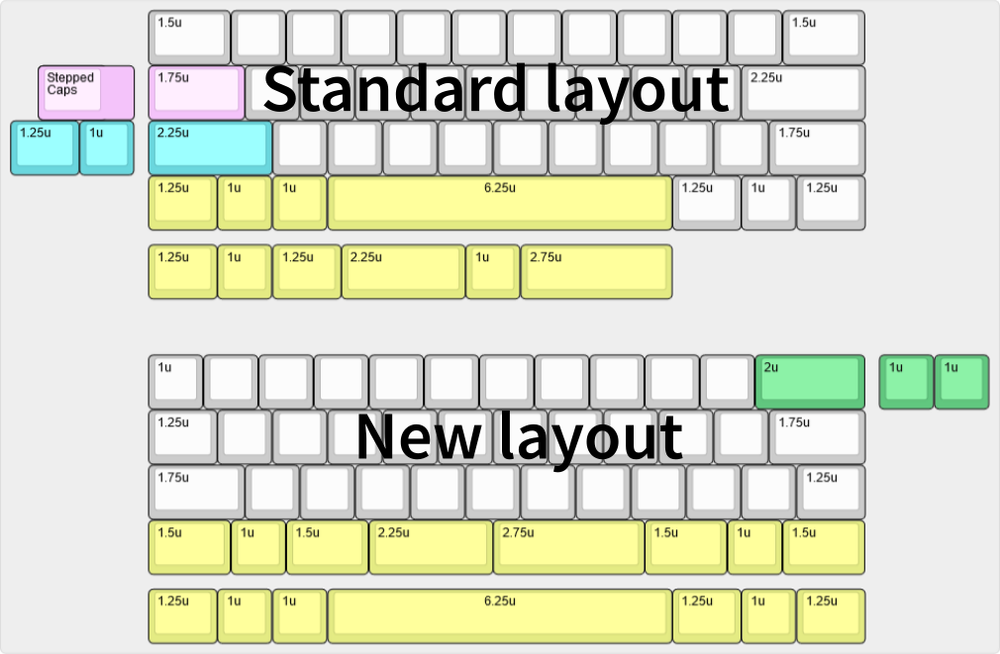
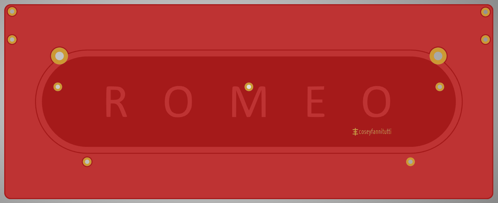

# ROMEO PUTAIN Edition

  

Staggered 40% QMK and VIA compatible keyboard pcb assembled with only through hole components, including USB Type-C

**New layout to make a 40%+ keyboard, without changing the edge cuts**

Old layout on top and new layout on bottom

**[BOM, Build Guide, and Flashing Information](./doc)**

~~Kits available at [cftkb.com](https://www.cftkb.com)~~

**[Optional High Profile Lasercut Acrylic Case](./case)**

